<!-- ═══════════════════ HEADER ═══════════════════ -->
<p align="center">
  
</p>

<p align="center">
  
</p>

<p align="center">
  <a href="https://aporkolab.com"></a>
  <a href="https://linkedin.com/in/adamporkolab"></a>
  <a href="https://medium.com/@aporkolabsdevhackery"></a>
  
</p>

---

## Who

I build and refactor Java/Spring Boot backends and Angular frontends, usually in systems nobody has documented in years. I came to software from linguistics, and the PhD left me with a low tolerance for architecture that has no consistent grammar.

The other half of my week goes into fiction. Folk horror, bureaucratic SF, and a subgenre I named liturgicore, written in Hungarian and English.

```yaml
role:      Senior Full-Stack Engineer
based:     Pécs, Hungary  ·  UTC+1/+2
mode:      Remote-first, async-first, written spec over standup
currently: Java 21, Spring Boot, Angular, and a long-running SF universe
```

---

## 🛠 Stack

<table>
<tr><td><b>Backend</b></td><td>


</td></tr>
<tr><td><b>Frontend</b></td><td>


</td></tr>
<tr><td><b>Data</b></td><td>


</td></tr>
<tr><td><b>Ops</b></td><td>


</td></tr>
<tr><td><b>Also</b></td><td>


</td></tr>
</table>

---

## 🕯 Open source

**[miserend.hu](https://github.com/borazslo/miserend.hu)**: the mass schedule of every Catholic church in Hungary. PHP backend, Angular front, Docker-based dev environment, and a real user base that notices within the hour when something breaks. I contribute to the codebase, and to a few adjacent community projects.

Small, unglamorous, load-bearing software. My favourite kind.

---

## ✒️ The other half

<p align="left">
  <a href="https://adamporkolab.com/en/"></a>
  <a href="https://pronekoverse.com"></a>
  
</p>

Speculative fiction in Hungarian and English. Recent homes for the work include *Galaktika*, *Terrain.org*, and the Liars' League London stage. **PRONEKOVERSE** is the long-form project: a science fiction universe with its own theology and its own bad political decisions.

The engineering and the fiction feed each other more than either side likes to admit. Bureaucracy, permission models, and the specific horror of an undocumented legacy system all turn up in both.

---

<!-- ═══════════════════ STATS (decoration, kept last on purpose) ═══════════════════ -->

<p align="center">
  
  
</p>

<p align="center">
  
</p>

<p align="center">
  
</p>
