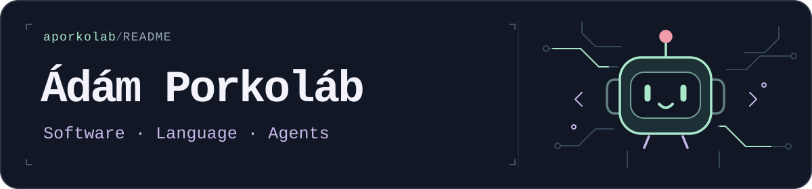
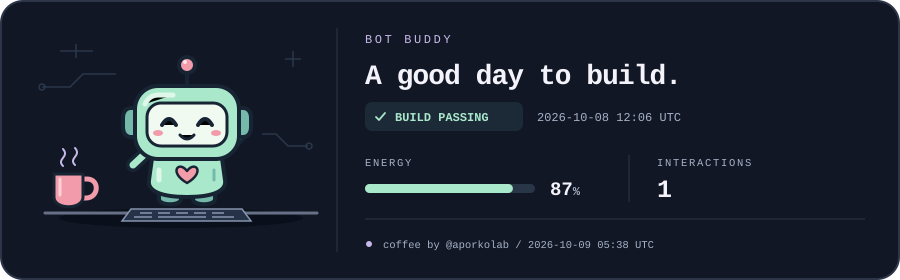

  <a href="https://aporkolab.com">Engineering</a> &nbsp; / &nbsp;
  <a href="https://adamporkolab.com/en/">Fiction</a> &nbsp; / &nbsp;
  <a href="https://www.linkedin.com/in/adamporkolab">LinkedIn</a> &nbsp; / &nbsp;
  <a href="https://aporkolabsdevhackery.medium.com">Field notes</a>

I build Java/Spring backends and Angular frontends, often in systems whose documentation has gone missing. I came to software from linguistics; the PhD left me with a low tolerance for architecture that has no consistent grammar.

At **Számlázz.hu**, I'm an **AI Champion** in two areas: **agentic development & orchestration**, and **prompt & context engineering**. I work on the brief, the boundaries between agents, the checks, and the decisions that still need a person.

### Try something

| Play / inspect | Break / build |
| :--- | :--- |
| **[Whack-a-Bug ↗](https://aporkolab.github.io/)** 45 seconds. Nine holes. Spare the friendly robots. [Source](https://github.com/aporkolab/aporkolab.github.io) · JavaScript / original SVG | **[Break the backend ↗](https://github.com/aporkolab/senior-backend-patterns/blob/main/docs/break-the-backend.md)** Trip a circuit breaker. Follow the recovery. Inspect the dead-letter queue. [Open in Codespaces](https://codespaces.new/aporkolab/senior-backend-patterns) · Java / Kafka |
| **[Kalliope ↗](https://aporkolab.github.io/Kalliope/)** Give it a Hungarian poem. Ask why a syllable is long. [Source & shared authorship](https://github.com/aporkolab/Kalliope) · Java → browser | **[Truholdem ↗](https://github.com/aporkolab/Truholdem)** Poker, Monte Carlo opponents, WebSockets, and the awkward business of side pots. [Architecture & setup](https://github.com/aporkolab/Truholdem#readme) · Spring / Angular |
| **[Build Escape ↗](https://aporkolab.github.io/build-escape/)** Rescue Bot Buddy from a broken build. Three playable repair puzzles. [Terminal version & source](https://github.com/aporkolab/build-escape) · zero runtime dependencies | **[Agent Arena ↗](https://aporkolab.github.io/agent-arena/)** Five broken programs. Two agent workflows. Inspect the patches and actual test logs. [Reproduce the experiment](https://github.com/aporkolab/agent-arena) · Java / TypeScript |

### How I work with agents

**[Copy the workflow →](https://gist.github.com/aporkolab/a52b750a3ac14e9dc02820c31533230b)** &nbsp; **[Read one actual build →](https://github.com/aporkolab/.github/blob/main/docs/whack-a-bug-case-study.md)**

A concrete brief. Separate work where it can be independent. Integrate. Review the diff with fresh context. Run the checks. Change direction when the result misses the point.

The Whack-a-Bug case study includes two rejected directions, the correction that mattered, and links to the code and deployment. **[Verse Check](https://github.com/aporkolab/verse-check)** turns the Kalliope engine into a reusable GitHub Action. Yes, a pull-request title can be a hexameter.

**[Agent Arena](https://aporkolab.github.io/agent-arena/)** records a solo implementation and a separate implementation with independent review. The task suite, candidate code and test output are public. It is one recorded experiment, with its measurement limits stated alongside the results.

### The resident debugger

  <a href="https://github.com/aporkolab/APorkolab/issues/new?template=buddy-coffee.yml">☕ Give coffee</a> &nbsp; · &nbsp;
  <a href="https://github.com/aporkolab/APorkolab/issues/new?template=buddy-debug.yml">🔎 Hunt a bug</a> &nbsp; · &nbsp;
  <a href="https://github.com/aporkolab/APorkolab/issues/new?template=buddy-nap.yml">☾ Let them nap</a>

Submit the prefilled issue to take a turn. An Action updates the scene and closes the command. One turn per person every 15 minutes; refresh after the run finishes. [How it works](./docs/bot-buddy.md).

### The rest of the desk

**Java · Spring · Angular · TypeScript · PostgreSQL · Kafka · Docker · GitHub Actions.** Pécs, Hungary. Remote-first, async-first.

I contribute to **[miserend.hu](https://github.com/borazslo/miserend.hu)**, and write speculative fiction in Hungarian and English. **[PRONEKOVERSE](https://pronekoverse.com)** is the long-form project: a science-fiction universe with its own theology and its own bad political decisions. Bureaucracy and undocumented systems keep turning up in both halves of my work.
